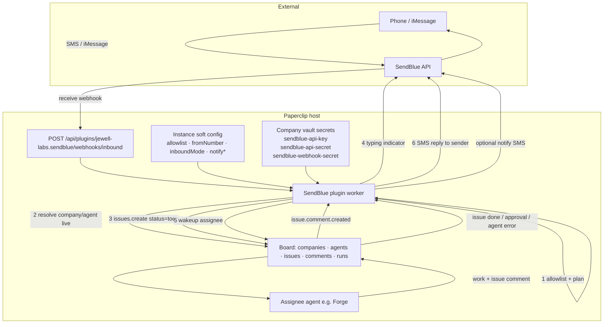

# @jewell-labs/paperclip-plugin-sendblue

SendBlue (iMessage / SMS / RCS) connector for [Paperclip](https://github.com/paperclipai/paperclip).

Outbound agent tools, inbound webhooks, E.164 allowlists, conversation loop (typing + SMS reply),
and board event notifications. **Issues remain the system of record.**

| | |
| --- | --- |
| **Plugin id** | `jewell-labs.sendblue` |
| **Package** | `@jewell-labs/paperclip-plugin-sendblue` |
| **Quality gate** | `npm run check` (111 unit tests, no network) |

---

## How it works with Paperclip



### Layers

| Layer | Responsibility |
| --- | --- |
| **SendBlue** | Carrier: send/receive, typing, webhooks |
| **Plugin worker** | Tools, inbound plan, conversation state, notify, health |
| **Company vault** | Credentials (multi-company by shared key names) |
| **Soft config** | Allowlist, lines, inbound mode, notify toggles — **no company UUIDs** |
| **Board** | Companies, agents, issues, comments, runs — routing resolved **live** |

### Conversation loop (inbound → agent → SMS)

1. Webhook `inbound` → verify secret (optional) → E.164 allowlist.
2. Live **board routing**: active company + engineer/CEO agent (not plugin config).
3. `create_issue` (status `todo`) + store conversation mapping on issue state.
4. **Typing** via SendBlue while agent wakes / runs.
5. Wake assignee via board REST (`PATCH` issue todo + `POST` agent wakeup).
6. Agent posts a comment → plugin SMS-replies (markdown stripped for SMS).

### Agent tools

Fifteen tools (namespaced as `jewell-labs.sendblue:<name>`). Descriptions are agent-oriented
(`TOOL_META`). Parameters E.164 where needed; outbound numbers allowlist-enforced.

`send_message` · `send_group_message` · `send_reaction` · `send_typing_indicator` · `mark_read` ·
`create_group` · `list_lines` · `list_messages` · `get_status` · `list_contacts` · `add_contact` ·
`evaluate_service` · `list_account_webhooks` · `create_account_webhook` · `delete_account_webhook`

---

## Secrets (required)

Provision on **each company** that should use the plugin (same names enable multi-company):

| Vault key | Purpose |
| --- | --- |
| `sendblue-api-key` | SendBlue API key id |
| `sendblue-api-secret` | SendBlue API secret |
| `sendblue-webhook-secret` | Shared secret for inbound webhook (optional but recommended) |

Worker resolve order (all first-class): plain config → **env** → **ops files** under
`/paperclip/instances/default/secrets/` → optional vault ref → canonical vault keys.

Board routing / issue create / assignee wake on inbound use the **board REST client**
with a provisioned board API key (`BOARD_API_KEY` or ops file `board-api-key-sendblue-ops`).

Interactive setup: **`.grok/skills/plugin-configuration`** (`/plugin-configuration`) —
**secrets first**, then soft config, then health.

---

## Soft configuration

Instance `configJson` (no company/agent UUIDs):

| Field | Notes |
| --- | --- |
| `fromNumber` | Default SendBlue line (E.164) |
| `allowlist` / `emptyMeansDeny` | Outbound + inbound gate |
| `notifyNumber` + `notifyOn*` | Optional board-event SMS. **`notifyOnIssueDone` defaults off** (agent conversation reply is enough) |
| `inboundMode` | `create_issue` \| `log_only` \| `ignore` |
| `apiKeyRef` / … | Optional overrides; often omitted when host 422s secret refs |

Company / project / assignee come from **live board resolve**, not config.

---

## Healthcheck (system go)

```text
GET  /api/plugins/jewell-labs.sendblue/health
POST /api/plugins/jewell-labs.sendblue/bridge/data
     {"key":"settings-overview","params":{}}
```

| Signal | Meaning |
| --- | --- |
| `credentialsConfigured` | Vault/env/files resolved API key+secret |
| `secrets.*` | Per-secret presence + expected vault key names |
| `boardRouting.ok` | Live company (and preferably assignee) resolved |
| `status` | `ok` \| `degraded` \| `error` |

---

## Install / develop

```bash
cd plugins/paperclip-plugin-sendblue
npm install
npm run check
```

Local-path install into Paperclip: monorepo root `README.md` + `scripts/stage-and-install.sh`.

Settings UI: **Settings → Instance → Plugins → SendBlue**.

Webhook URL:

```text
https://<public-host>/api/plugins/jewell-labs.sendblue/webhooks/inbound
```

---

## Quality gate

| Step | What |
| --- | --- |
| `version:check` | package.json ≡ `PLUGIN_VERSION` |
| `lint` / `typecheck` | Strict TS + ESLint |
| `deadcode` | knip |
| `test` | vitest, mock fetch only |
| `build` | `tsc` + UI esbuild |

---

## License

MIT — see [LICENSE](./LICENSE).

## References

- [SendBlue API v2](https://docs.sendblue.com/api-v2/)
- [SendBlue webhooks](https://docs.sendblue.com/getting-started/webhooks/)
- [Paperclip plugins](https://github.com/paperclipai/paperclip)
